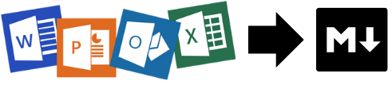

# Office to Markdown Converter

<p align="center">
  
</p>

A simple Streamlit web application that converts Microsoft Office documents and other file formats to Markdown using Microsoft's [MarkItDown](https://github.com/microsoft/markitdown) package.

## Features

- Convert various file formats to Markdown:
  - Microsoft Office files (Word, PowerPoint, Excel)
  - PDF files
  - HTML files
  - Text-based formats (CSV, JSON, XML)
  - YouTube URLs (transcripts)
  - And more!
- Clean and intuitive user interface
- Preview converted Markdown content
- Download converted Markdown files

## Installation

1. Install the required dependencies:
```
pip install -r requirements.txt
```

## Usage

1. Run the Streamlit app:
```
streamlit run app.py
```

2. Open your web browser and navigate to the URL displayed in the terminal (usually http://localhost:8501)

3. Upload a file or provide a YouTube URL to convert to Markdown

4. Preview and download the converted Markdown content


## 🤝 Connect with Me
- 📺 **YouTube:** [CodingIsFun](https://youtube.com/c/CodingIsFun)
- 🌐 **Website:** [PythonAndVBA](https://pythonandvba.com)
- 💬 **Discord:** [Join the Community](https://pythonandvba.com/discord)
- 💼 **LinkedIn:** [Sven Bosau](https://www.linkedin.com/in/sven-bosau/)
- 📸 **Instagram:** [sven_bosau](https://www.instagram.com/sven_bosau/)

## 💖 Support
If my tutorials help you, please consider [buying me a coffee](https://pythonandvba.com/coffee-donation).  
[](https://pythonandvba.com/coffee-donation)

## 📬 Feedback & Collaboration
If you have ideas, feedback, or want to collaborate, reach out at contact@pythonandvba.com.  
